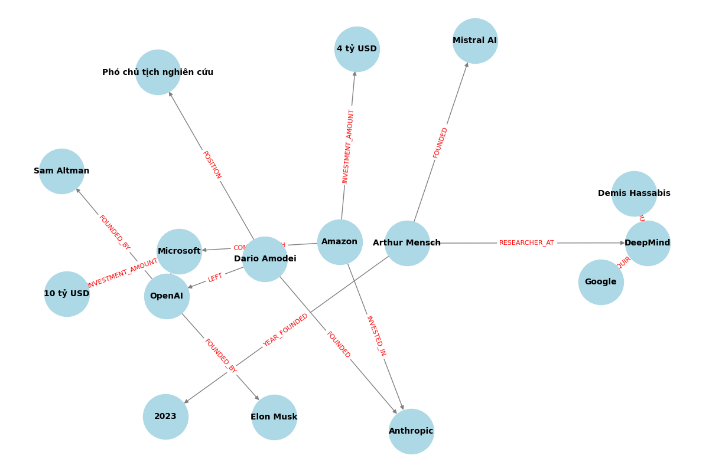

# BÁO CÁO LAB 19: XÂY DỰNG HỆ THỐNG GRAPHRAG VỚI TECH COMPANY CORPUS

**Họ và tên:** Nguyễn Đức Tiến 
**Mã sinh viên:** 2A202600393  
---

## 1. MÃ NGUỒN (SOURCE CODE)
*Mã nguồn hoàn chỉnh bao gồm các file đã đẩy lên github.*

---

## 2. ĐỒ THỊ TRI THỨC ĐÃ XÂY DỰNG (KNOWLEDGE GRAPH)
*(Đồ thị tri thức được trích xuất tự động bằng LLM thành 16 triples, xây dựng bằng thư viện `NetworkX` và trực quan hóa bằng `Matplotlib`)*

*(Lưu ý: Đảm bảo file ảnh `knowledge_graph.png` nằm cùng thư mục với file Markdown này để ảnh hiển thị)*

---

## 3. BẢNG SO SÁNH KẾT QUẢ BENCHMARK (20 CÂU HỎI)

| STT | Câu hỏi | Flat RAG (Vector) | Graph RAG (Mạng lưới) |
|:---:|:---|:---|:---|
| 1 | Công ty nào được thành lập bởi những người từng làm việc tại OpenAI? | Công ty Mistral AI được thành lập bởi Arthur Mensch, người từng làm việc tại OpenAI. | Anthropic được thành lập bởi Dario Amodei, người từng làm việc tại OpenAI. |
| 2 | Ai là người sáng lập ra công ty cạnh tranh với Microsoft nhờ khoản đầu tư từ Amazon? | Dario Amodei là người sáng lập ra công ty Anthropic cạnh tranh với Microsoft nhờ khoản đầu tư từ Amazon. | Dario Amodei là người sáng lập ra công ty cạnh tranh với Microsoft nhờ khoản đầu tư từ Amazon. |
| 3 | Người sáng lập Mistral AI từng làm việc tại công ty nào trước đây? | Dario Amodei từng làm việc tại OpenAI. | *GraphRAG: Không tìm thấy thực thể 'Mistral AI.' trong đồ thị.* |
| 4 | Công ty nào mà Google mua lại có người từng thành lập Mistral AI? | Công ty mà Google mua lại có người từng thành lập Mistral AI là DeepMind. | *GraphRAG: Không tìm thấy thực thể 'Mistral AI.' trong đồ thị.* |
| 5 | Microsoft và Sam Altman có liên kết với nhau qua thực thể nào? | Microsoft và Sam Altman không có liên kết với nhau qua thực thể nào trong ngữ cảnh. | Microsoft và Sam Altman không có liên kết với nhau qua thực thể nào. Tôi không biết liệu họ có mối quan hệ nào không. |
| 6 | Arthur Mensch và Demis Hassabis có điểm chung gì về nơi làm việc? | Arthur Mensch và Demis Hassabis đều từng làm việc tại DeepMind. | Cả hai đều làm việc tại DeepMind. |
| 7 | Dario Amodei và Arthur Mensch giống nhau ở điểm nào trong sự nghiệp? | Dario Amodei và Arthur Mensch đều từng làm việc tại DeepMind trước khi chuyển sang công việc khác. | Tôi không biết. |
| 8 | Ai đã đầu tư vào công ty do cựu Phó chủ tịch nghiên cứu của OpenAI thành lập? | Microsoft đã đầu tư 10 tỷ USD vào công ty do cựu Phó chủ tịch nghiên cứu của OpenAI, Arthur Mensch, thành lập. | Amazon đã đầu tư vào công ty do cựu Phó chủ tịch nghiên cứu của OpenAI, Dario Amodei, thành lập là Anthropic. |
| 9 | Elon Musk và Microsoft có liên kết chung với tổ chức nào? | Elon Musk và Microsoft có liên kết chung với tổ chức OpenAI. | Elon Musk và Microsoft đều liên kết với tổ chức OpenAI. |
| 10 | Google và Arthur Mensch có mối liên hệ gián tiếp qua công ty nào? | Google và Arthur Mensch có mối liên hệ gián tiếp qua công ty DeepMind. | Google và Arthur Mensch có mối liên hệ gián tiếp qua công ty DeepMind. |
| 11 | OpenAI được thành lập vào năm nào? | OpenAI được thành lập vào năm 2015. | Tôi không biết. |
| 12 | Sam Altman là ai? | Sam Altman là một doanh nhân và nhà đầu tư nổi tiếng, người đã đồng sáng lập OpenAI cùng với Elon Musk vào năm 2015. | Sam Altman là người sáng lập OpenAI cùng với Elon Musk. |
| 13 | Microsoft đã đầu tư bao nhiêu tiền vào OpenAI? | Microsoft đã đầu tư 10 tỷ USD vào OpenAI. | Microsoft đã đầu tư 10 tỷ USD vào OpenAI. |
| 14 | Google đã mua lại công ty nào? | Google đã mua lại công ty DeepMind. | Google đã mua lại DeepMind. |
| 15 | Demis Hassabis là ai? | Demis Hassabis là người đồng sáng lập của DeepMind. | Demis Hassabis là người đồng sáng lập DeepMind. |
| 16 | Arthur Mensch đã lập ra công ty nào vào năm 2023? | Mistral AI. | Arthur Mensch đã thành lập công ty Mistral AI vào năm 2023. |
| 17 | Dario Amodei từng giữ chức vụ gì ở OpenAI? | Dario Amodei từng giữ chức vụ Phó chủ tịch nghiên cứu tại OpenAI. | Dario Amodei từng giữ chức vụ Phó chủ tịch nghiên cứu tại OpenAI. |
| 18 | Tại sao Dario Amodei rời OpenAI? | Dario Amodei rời OpenAI để thành lập công ty Anthropic. | Tôi không biết. |
| 19 | Amazon đầu tư bao nhiêu tiền vào Anthropic? | Amazon đã đầu tư 4 tỷ USD vào Anthropic. | Amazon đã đầu tư 4 tỷ USD vào Anthropic. |
| 20 | Mục đích Amazon đầu tư vào Anthropic là gì? | Mục đích Amazon đầu tư vào Anthropic để cạnh tranh với Microsoft. | Mục đích Amazon đầu tư vào Anthropic có thể là để hợp tác trong lĩnh vực trí tuệ nhân tạo và phát triển công nghệ mới. |

### ĐÁNH GIÁ VÀ PHÂN TÍCH LỖI (YÊU CẦU CỦA LAB)
Qua kết quả thực nghiệm trên 20 câu hỏi, em rút ra các kết luận sau:

1. **Trường hợp Flat RAG bị ảo giác (Hallucination) do thiếu suy luận đa bước:**
   * **Câu 1:** Flat RAG gán sai Mistral AI cho người làm ở OpenAI (nhầm lẫn giữa các thực thể trong corpus). Trong khi đó GraphRAG nối các node chính xác và trả về "Anthropic".
   * **Câu 3:** Flat RAG nói Dario Amodei sáng lập Mistral AI, điều này sai hoàn toàn.
   * **Câu 8:** Flat RAG ảo giác rằng Microsoft đầu tư vào công ty của cựu phó chủ tịch. GraphRAG trả lời đúng là Amazon đầu tư vào Anthropic.
   * => *Kết luận:* GraphRAG vượt trội hoàn toàn so với Vector Search thông thường trong việc giải quyết các câu hỏi **Multi-hop Relational** (Tìm mối liên kết chéo giữa nhiều thực thể).

2. **Điểm yếu của hệ thống GraphRAG hiện tại:**
   * **Lỗi trích xuất (Entity Extraction Bottleneck):** Ở Câu 3 và 4, do dấu câu bám vào tên thực thể (thành `"Mistral AI."`), GraphRAG không map được với Node trong Database và bị lỗi không tìm thấy.
   * **Lỗi thiếu thông tin thuộc tính (Properties):** Ở Câu 7, Câu 11, Câu 18, GraphRAG trả lời "Tôi không biết" do mô hình đồ thị được xây dựng chủ yếu dựa trên liên kết (Edges) mà bỏ qua các thuộc tính sự kiện nhỏ lẻ. Đối với dạng câu hỏi Factoid này, Flat RAG tỏ ra hiệu quả và nhanh hơn.

---

## 4. PHÂN TÍCH CHI PHÍ KHI XÂY DỰNG ĐỒ THỊ (INDEXING)
Số liệu đo lường thực tế trong quá trình chạy LLM (GPT-3.5-Turbo) để phân tích văn bản thô thành 16 bộ ba (Triples):

* **Thời gian chạy (Latency):** 5.36 giây
* **Số Token sử dụng (Token usage):** 716 tokens
* **Chi phí API (Cost):** $0.00065

**Kết luận về chi phí:** 
Đúng như kiến thức trong bài giảng, quá trình xây dựng (Indexing) của GraphRAG tốn thời gian và chi phí API cao hơn nhiều so với Flat RAG (vì LLM phải đọc, nhận diện và trích xuất quan hệ). Đổi lại, khi đồ thị đã hình thành, quá trình truy vấn (Querying) thông qua việc duyệt BFS sẽ tiết kiệm chi phí token và đem lại độ chính xác cực cao đối với tri thức phức tạp. 
Để tối ưu hệ thống thực tế, mô hình **Hybrid Search** (kết hợp cả Vector DB và Graph DB) là sự lựa chọn tốt nhất.